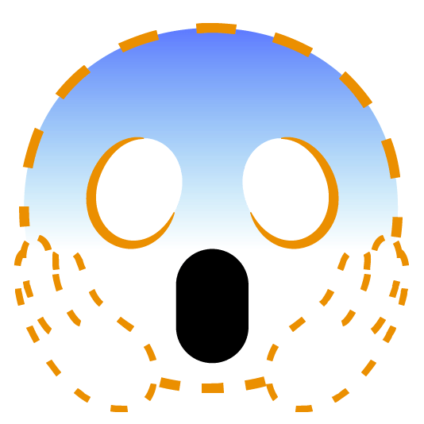
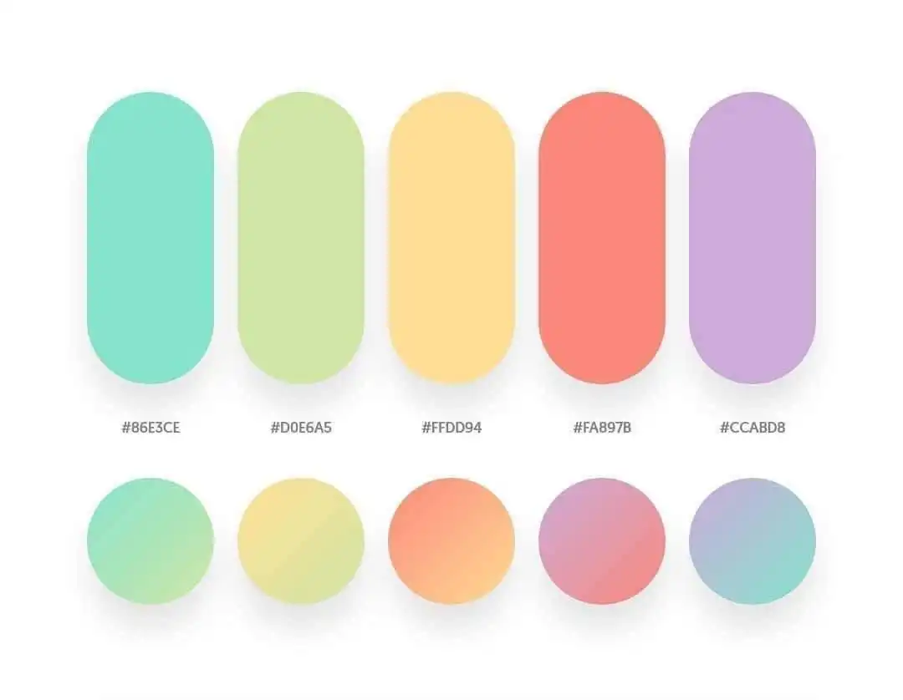

# CPE334Project
For subject CPE334, KMUTT

# Project Idea
- Daily Life Management Android Application

### Daily Life Management as a Student
- Pin notes and due dates, can add stages with tags
- Group notifications
- To-buy list + To-Do List
- Price Calculator
- Map Links for meet-ups
- Schedule

### Completed
- To-buy list + To-Do List 
- Sign in and Login
- Price Calculator

# Installation
- Planned APK file implementation
- Source code config
    - Virtual Environment
        - It is best to setup a virtual but if you don't want to then, then You do you.
        - Please setup venv outside of the repository ``` cd .. ```
        ```Shell
        python -m venv /path-to-virtual-environment
        ```
        In this case, we use 
        ```Shell
        python -m venv ../virenvproject
        ```
    - Cloning Repository
        - Install git and select the location you want to save the project
        ```Shell
        git clone https://github.com/Sirapobchon/CPE334Project.git
        ```
    - Extension used
        - Flet for UI
        ```Shell
        pip install flet
        ```
        - Pyrebase for Google Firebase
        ```Shell
        pip install pyrebase4
        ```

# Progress update

### 11 Dec Final Commit and Alpha Release ###
<details open>
<summary>Final Commit and Alpha Release/summary>

@sirapobchon - As the project deadline approaches, the sprint 4 has come to an end. We, along with the scrum master, have determined that the project is not fully prepared for a complete release. Consequently, the project will be shared without being packaged into a .apk file. Instead, it will be provided solely as source code for our use in sprint 5 and beyond, should we choose to proceed.
    
</details>

### 4 Dec Packaging Planning and code refactoring ###
<details>
<summary>Packaging and Installation</summary>

- Packaging Planning
    - New automated Virtual Environment and Extension needed installation planned
- Pop-Up Bug fix
- Account page with backend
- UserID client storage
    
</details>

### 23 Nov Sprint End Meeting and Start 4th sprint
<details>
<summary>3rd Sprint End Meeting and Start 4th sprint</summary>

- New 4th sprint due to an increase in time
- Report in progress
    - Narrative finish
    - Ask @EXer07 to help do the report

</details>

### 20 Nov Report Making and the Completed Pagelink
<details>
<summary>Report Progress and Completed pagelink</summary>

- Big Achievement with the page link completion 
    - The only missing page is the Calendar
    - Some minor bug with the homepage but every page is linked together
    - Now is the time to start compiling all the comments and documentation
- Report Progressing 
    - Completed
        - Abstract
        - Functional Requirements
        - Architectural Design
            - Tools
    - WIP
        - Computing Languages
        - Component and User Interface
- Planning some major and minor bug fixes
    - To-do list connection to the backend
    - To buy list connection to the backend
    - Forget Password connection to the backend

- Scrum process
    - sprint
        - 9 Nov - 22 Nov
            - @EXer07 Connect To Do and To Buy with Async - 3/3 done
            - @pppcyd Change NaviBar 2/2 and Backend Variable 0/1 - 2/3
            - @janekmutt Forget Password Page - 1/1 done, Account Page - 2/3 remaining left for @Sirapobchon backend
            - @Sirapobchon Firebase Server - 8/14 The only backend current is login and signup
            - @Sirapobchon Connect Calculator - 3/3 done
            - @WangSonicS Calendar that can hold reminders - 2/8 calendar done but nothing else
        - 22 Nov - 6 Dec
            - Moved Deadline. Yay! Happy day!

</details>

### 9 Nov Sprint End Meeting and Start 3rd Sprint
<details>
<summary>2nd Sprint End Meeting and Start 3rd Sprint</summary>

- Current 2nd Sprint Work for Each Member
    - @EXer07 and @Sirapobchon Page Connection - 8
        - @EXer07 *Navigation Bar connection problem*
        - https://youtu.be/1at0ZZF24Hs?si=jC8EpQAn1wn5Hy3O
    - @janekmutt Forget Password Page - 1 and Account Page - 3
    - @pppcyd *To Do and Buy connection problem* - 3
    - @WangSonicS Calendar Page - 8

- Backend table by @Sirapobchon and @pppcyd
    - Authenticate (User sign-in) - 2/2 Done
    - ToDo Data - 0/1
    - ToBuy Data - 0/1
    - Calendar - 0/2
    - Data Connection - 0/2
    - Total 2/8

- Scrum process
    - sprint
        - 9 Nov - 22 Nov
            - @EXer07 Connect To Do and To Buy with Async
            - @pppcyd Change NaviBar and Backend Variable
            - @janekmutt Forget Password Page - 1, Account Page - 3
            - @Sirapobchon Firebase Server - 8 remain 6
            - @Sirapobchon Connect Calculator
            - @WangSonicS Calendar that can hold reminders - 8
        - 22 Nov - 28 Nov

</details>

### 3 Nov Progress Update Meeting
<details>
<summary>Update Codebase</summary>

- Main connecting page
    - @EXer07 and @Sirapobchon
    - Use main.py to connect to the homepage, login, signup, todo, tobuy, and calendar

- @everyone Whoever is free, start making a report
    - Report Requirement
    - Abstract
    - Problem Definition
        - Functional Requirement - Done
        - Use-case Diagram
        - Use-case Narrative
    - Architectural Design
        1. Tools
            - Diagram Drawing Tools
                - Visual-Paradigm
            - Source Control Management
                - GitHub
            - UI Design Tools
                - Canvas
            - IDE
                - VS Code with extension
            - Compile
                - Android Studio
        2. Computing Languages
            - Python
                - Flet UI
            - Google Firebase
                - Firebase Backend
        3. Component and User Interface
    - Other Design Elements
        1. Activities Diagram
        2. Sequence Diagram
        3. Package Diagram
        4. Database Diagram
    - Development Process
    - Self-Evaluation
    - Appendix

- Backend table by @Sirapobchon and @pppcyd
    - Authenticate (User sign-in) - 2/2 Done
    - ToDo Data - 0/1
    - ToBuy Data - 0/1
    - Calendar - 0/2
    - Data Connection - 0/2
    - Total 2/8

- Scrum process
    - @EXer07 Notification - 3
    - @janekmutt Forget Password Page - 1
    - @EXer07 and @Sirapobchon Firebase Server - 8 remain 6
    - @WangSonicS Calendar that can hold reminders - 8

</details>

### 1 Nov Backend Meeting
<details>
<summary>Deciding the Back-end future</summary>

### Change to Google Firebase instead of Django
- Reason:
    - easier
    - cloud hosting (No need to open own server)

- Scrum process
    - @EXer07 Notification - 3
    - @janekmutt Forget Password Page - 1
    - @EXer07 and @Sirapobchon Firebase Server - 8

</details>

### 26 Oct 2ND Sprint Start Meeting
<details>
<summary>Sprint Start Meeting</summary>

- Scrum process
    -  Sprints
        - 26 Oct - 9 Nov
            - Scoring and Scrum Planning
            - @pppcyd To Buy-list - 3
            - @janekmutt Value Calculator - 2
            - @janekmutt Home page continues - 1
            - @WangSonicS Calendar that can hold reminders - 8
            - @EXer07 and @Sirapobchon backend stuff for all pages - alot
            - @everyone Whoever is free, start making a report
        - 9 Nov - 22 Nov
        - 22 Nov - 28 Nov
    
- The work should be completed more than 80% because if not it will not be completed in time.

</details>

### 19 Oct Sprint End Meeting
<details>
<summary>Sprint End Meeting</summary>

- Scrum process
    -  Sprints
        - 6 Oct - 19 Oct
            - Login and Signup Page @EXer07 
                - Score 3 remaining 2 point
                - Need Link Page and Backend @Sirapobchon
            - To-Do List @pppcyd
                - Score 2 remaining 1 point
                - Remaining Backend @Sirapobchon
            - Home page @janekmutt
                - Score 2 remaining 1 point
                - Icon instead of picture
            - Connecting Page
                - Come from the Home Page of Jane
                - Waiting for Jane to be done with the Home page
                - Scoring up to 8
        - 26 Oct - 2 Nov
        - 3 Nov - 15 Nov
        - 17 Nov - 28 Nov
    - Requirement Calculation score
        - Home page - 3
            - Connecting Page (Continuation from Home Page)
        - Login and Signup Page - 5
        - To-Do List and To-Buy List - 3
        - Price and Value Calculation - 2
        - Calendar - 8
        - Notification - 5
    - Next sprint planning
        - Starting 26 Oct due to Midterm test

</details>

### 11 Oct Emergency Meeting
<details>
<summary>The big OH... moment</summary>

@Sirapobchon had discovered that flet(UI) could only be run as one file. 

No dividing into multiple .py files to run. 
Only import to be page run in the main.py file.
Meeting to let everyone know that the file format will probably need to be changed. 


- Need fixing
    - login.py
    - main.py
    - Django
        - settings.py
        - urls.py
        - user app
            - models.py
            - views.py

</details>

### 5 Oct planned meeting
<details>
<summary>Thursday 5 Oct Meeting planning</summary>

- Main Function to be done
    - To-do list 
    - To-buy list 
        - Total price calculation
    - Notification
    - Calendar
        - With note 
    - Login and Signup page 
    - Price Budget Calculate
        - New idea

- New Functional Requirements:
    - Login and Signup Page:
        - Users should be able to create an account with a username and password.
        - Existing users should be able to log in securely.
        - There should be password recovery options (e.g., email verification, security questions).
        - User authentication should be secure and protect user data.
    - To-Do List and To-Buy List:
        - Users should be able to create, edit, and delete tasks.
        - Each task should have a title, description, due date, and priority.
        - Tasks should be organized by categories or projects.
        - Users should be able to mark tasks as completed.
        - There should be a way to filter and sort tasks (e.g., by due date or priority).
        - Users should receive notifications or reminders for upcoming tasks.
        - Users should be able to create a shopping list.
        - Each item on the list should have a name, quantity, and optional notes.
        - Users should be able to mark items as purchased or delete them.
        - There should be a way to categorize items (e.g., groceries, household items).
    - Price and Value Calculation:
        - Users should be able to input prices and quantities of items.
        - The application should calculate the total cost and provide a breakdown.
        - Users should be able to calculate the value of items (e.g., investments, assets).
        - There should be support for different currencies or units of measurement.
    - Calendar:
        - Users should be able to add events/appointments to the calendar.
        - Each event should have a title, date, time, location, and notes.
        - Users should be able to view their calendar by day, week, or month.
        - Calendar should support recurring events (e.g., weekly meetings).
        - Users should have the option to set reminders for calendar events.
    - Notification:
        - Users should receive notifications for various events (e.g., task deadlines, calendar events).
        - Notifications should support multiple platforms (e.g., mobile notifications, email notifications).
        - Users should have the option to customize notification preferences (e.g., sound, vibration).

- Scrum process
    - @pppcyd Scrum Master
    - 2 Week of Sprint Length
    - 4 Sprints
        - 6 Oct - 19 Oct
            - Login and Signup Page @EXer07
            - To-Do List and To-Buy List @pppcyd
            - Home page @janekmutt
        - 20 Oct - 2 Nov
        - 3 Nov - 15 Nov
        - 17 Nov - 28 Nov
    - Requirement Calculation score
         - Login and Signup Page - 5
         - To-Do List and To-Buy List - 3
         - Price and Value Calculation - 2
         - Calendar - 8
         - Notification - 5

- Theme template deciding
    - Font theme
        - SF Pro https://developer.apple.com/fonts/
    - Color theme
        - 
        - #86E3CE
        - #D6E6A5
        - #FFDD94
        - #FA897B
        - #CCABD8

</details>

### 25 Sep First Draft
<details>
<summary>Functional Requirements</summary>

Functional Requirements:

- User Registration and Profile:
    - Users can create accounts and log in.
    - Users can update their profiles.
- Dashboard:
    - Users see a home screen showing notes, due dates and notifications.
- Notes and Tasks:
    - Users can create, edit, and delete notes.
    - Tasks can be organised with stages and tags.
    - Tasks have priorities and deadlines.
    - There's a to-do list for tasks.
- Groups and Notifications:
    - Users can create and join groups.
    - Groups support announcements and notifications.
- Shopping List:
    - Users can create shopping lists.
    - Easy item management and reminders.
- Map Integration:
    - Users can share map links.
- Schedule and Calendar:
    - Users have a calendar for events.
    - Events support reminders.
- Settings and Security:
    - Users can customise app settings.
    - Ensure data security and privacy.
- Offline Mode:
    - App works offline with basic features.
- Data Backup and Sync:
    - Users can back up and sync data.
- Feedback and Support:
    - Users can provide feedback.
    - Include a help section.
- Documentation:
    - Provide a user manual.

</details>

### 24 Sep Meeting
<details>
<summary>Project Planning</summary>

- Project name
    - *INSERT COOL CATCHY NAME HERE*
    - LifeHack (Backup Name)
- Application
    - Android compile
        - https://youtu.be/NA2R7zagNzM?si=B_tl8xjbMyA8Ls27
    - Flutter(Flet) (UI) - @Sirapobchon,@pppcyd,@janekmutt,@EXer07
        - Python Language
        - https://www.codesass.com/blog/articles/flet      
    - Django (Backend) - @Sirapobchon,@EXer07,@WangSonicS
        - https://devhub.in.th/blog/django-python
- UI Designing (Flet)
    - Notification
        - https://youtu.be/dhQ-zPErVgQ?si=KPA64J1p7gnu7JXC
    - To-Do List
        - https://youtu.be/qRqxAUC_4oA?si=GD1teHgYMIzd__Xe
    - Learning Playlist
        - https://youtube.com/playlist?list=PLIYV27zh-hBEcu70pkUkdbwrJuKqdQ9tK&si=RCJESJDf4saLO4rm
- Github Progress update
    - Only me probably
    - For version keeping
    - Because "Coding"

</details>

### 11-12 Sep Consultation
<details>
<summary>Project approval</summary>

- Daily Life Management as a Student Project approval

</details>

